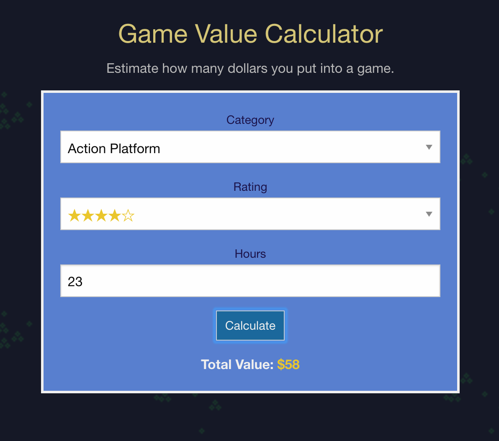

# Game Value Estimate

Estimate how much money was actually put into a game based on playtime, category, and how enjoyable it was.

There are three factors used to calculate a game's value.

 - **Category**: Different genres have a different value per hour. For example, single player games that are primarily story driven are typically shorter games, yet are still valued quite high. On the other hand, MMO-type games are specifically built to have a huge number of hours dumped into them.
 - **Rating**: Scale the dollars/hour of a game based on how well it was liked. A well liked game deserves some extra value, while a disliked game loses value.
 - **Hours**: Simply how many hours were spent playing the game. This is multipled by the scaled dollars/per that is detemrined by category and rating.

These metrtics are not meant to be accurate and provide definitive answers, rather they are just intended to be a helpful tool in the question of whether a game was indeed worth the price that was paid for it.

